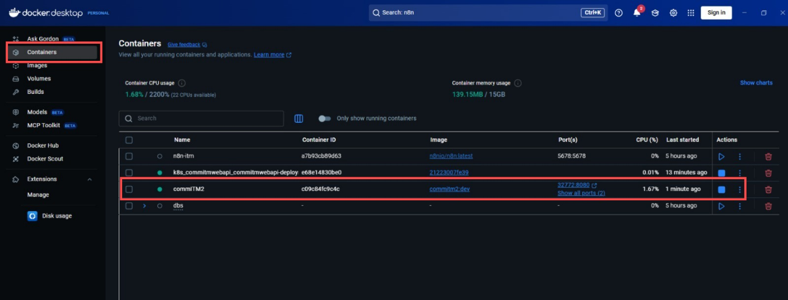
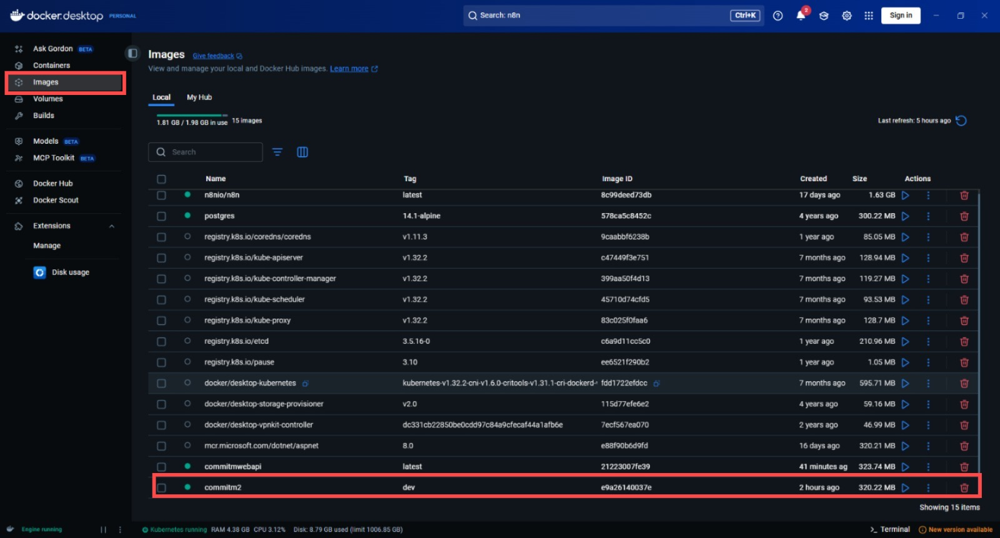
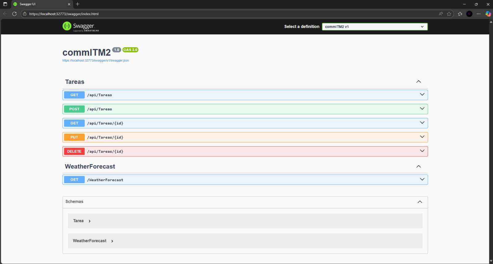
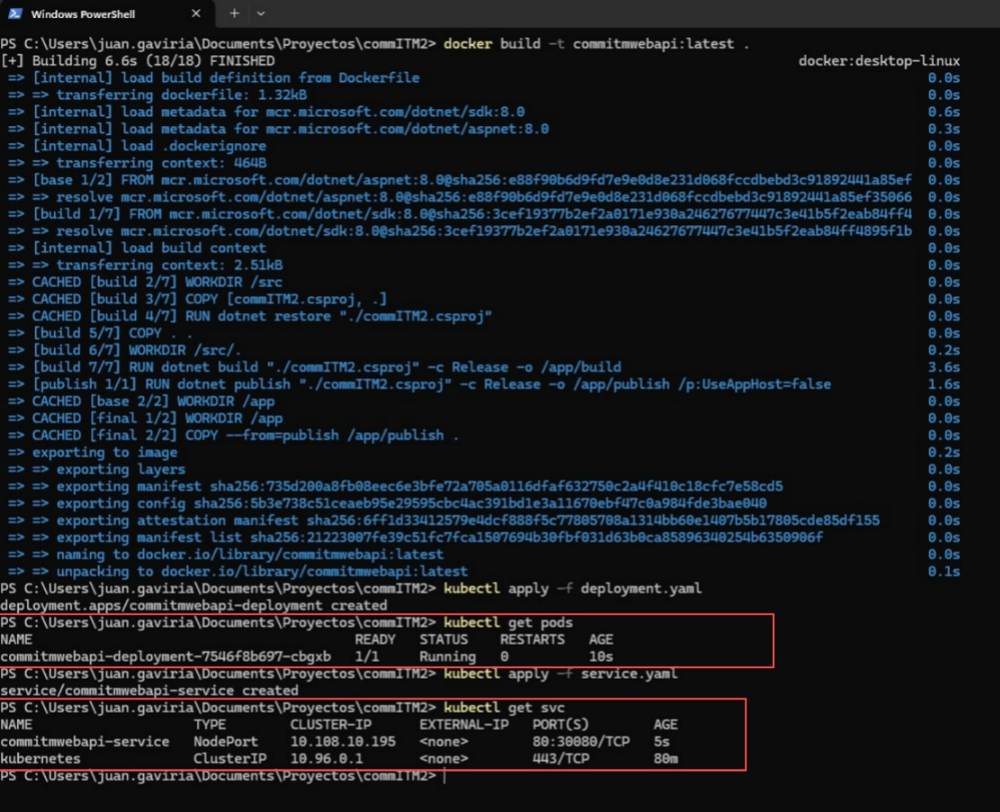
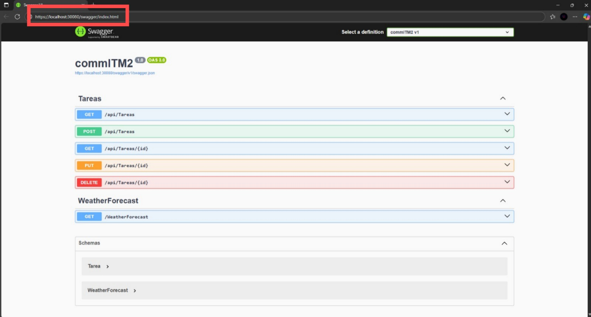
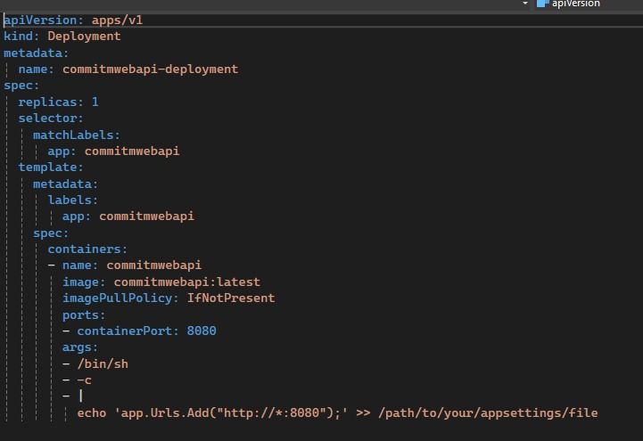
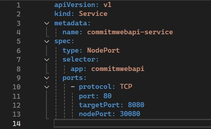
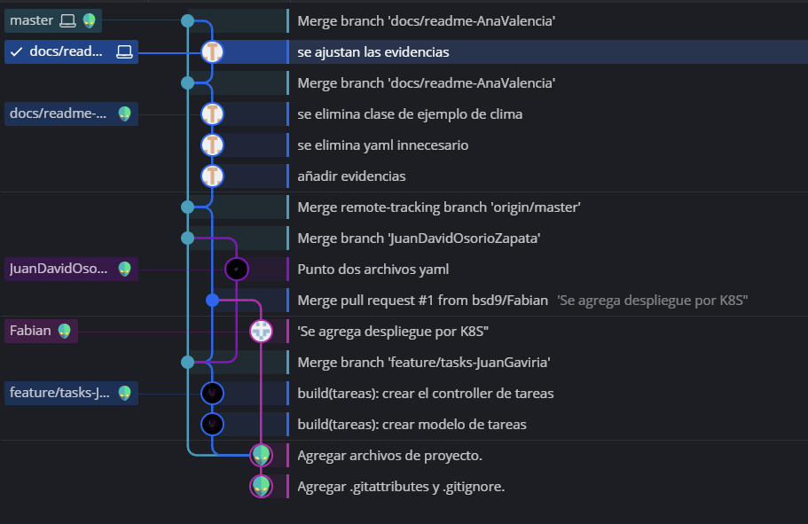

# Taller 2 - Despliegue (Docker, Kubernetes)

## Integrantes

- Juan David Gaviria Correa
- Ana Maria Valencia Quintero
- Juan David Osorio Zapata
- Fabian Jussep Rios Ferrer
- Johan Sneider Garzon Salazar

## Link De Video Youtube

[Ver en YouTube](https://youtu.be/mTeYAJ7OQU8)
## Evidencias

### Contenedor Docker Corriendo

### Imagen Creada

### Swagger UI

### Kubectl get pods y kubectl get svc  

### Navegador accediendo al servicio (Swagger)  

### YAML Deployment

### YAML Service

### Arbol Git Commits

